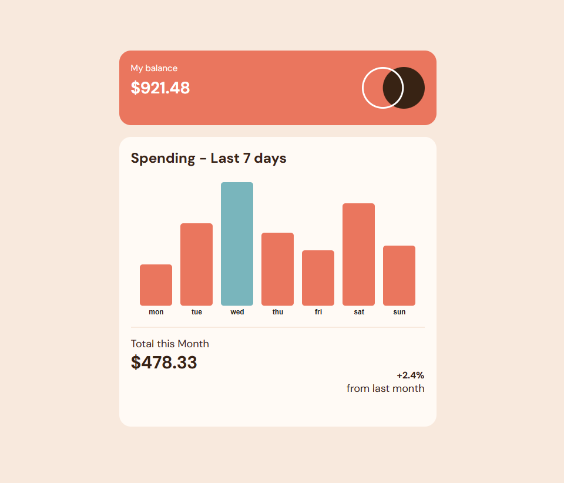

# Frontend Mentor - Expenses chart component solution

This is a solution to the [Expenses chart component challenge on Frontend Mentor](https://www.frontendmentor.io/challenges/expenses-chart-component-e7yJBUdjwt). Frontend Mentor challenges help you improve your coding skills by building realistic projects.

## Table of contents

-   [Overview](#overview)
    -   [The challenge](#the-challenge)
    -   [Links](#links)
-   [Built with](#built-with)
-   [Author](#author)

## Overview

### The challenge

Users should be able to:

-   View the bar chart and hover over the individual bars to see the correct amounts for each day
-   See the current day’s bar highlighted in a different colour to the other bars
-   View the optimal layout for the content depending on their device’s screen size
-   See hover states for all interactive elements on the page
-   Dynamically resize the bars depending on the provided data.

### Screenshot

### Links

-   Solution URL: [GitHub](https://github.com/SebastianZins/Frontend-Mentor_Expenses-chart-component)
-   Live Site URL: 

### Built with

-   Semantic HTML5 markup
-   TypeScript
-   [React](https://reactjs.org/) - JS library
-   [visX](https://airbnb.io/visx) - visualization library, based on d3.js, optimized for use with react
-   SCSS custom properties
-   CSS Transitions
-   CSS Media Queries
-   CSS Flexbox / Grid
-   Mobile-first workflow

## Author

-   GitHub - [@SebastianZins](https://github.com/SebastianZins)
-   Frontend Mentor - [@SebastianZins](https://www.frontendmentor.io/profile/SebastianZins)
